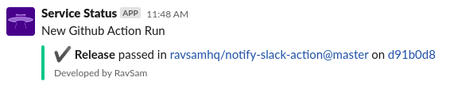
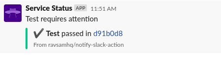
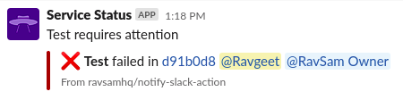

[](https://github.com/ravsamhq/notify-slack-action/actions/workflows/release.yml)
[](https://opensource.org/licenses/MIT)

# Notify Slack Action

Send Github Actions workflow status notifications to Slack regarding failures, warnings or even success. You can read more about the action in [our blog post](https://www.ravsam.in/blog/send-slack-notification-when-github-actions-fails/).

## Features

- [x] Ability to control when to send notification
- [x] Custom Notification Title, Message and Footer using template variables
- [x] Mention Users and control when to mention them
- [x] Mention Users Groups and control when to mention them
- [x] Customize icons based on the action status

## Example workflows
 
### Minimal workflow



```yaml
steps:
  - uses: ravsamhq/notify-slack-action@v1
    if: always()
    with:
      status: ${{ job.status }} # required
    env:
      SLACK_WEBHOOK_URL: ${{ secrets.SLACK_WEBHOOK_URL }} # required
```

### Extended Example without User Mentions



```yaml
steps:
  - uses: ravsamhq/notify-slack-action@v1
    if: always()
    with:
      status: ${{ job.status }}
      token: ${{ secrets.GITHUB_TOKEN }}
      notification_title: '{workflow} has {status_message}'
      message_format: '{emoji} *{workflow}* {status_message} in <{repo_url}|{repo}>'
      footer: 'Linked Repo <{repo_url}|{repo}> | <{workflow_url}|View Workflow>'
      notify_when: 'failure'
    env:
      SLACK_WEBHOOK_URL: ${{ secrets.SLACK_WEBHOOK_URL }}
```

### Extended Example with User Mentions



```yaml
steps:
  - uses: ravsamhq/notify-slack-action@v1
    if: always()
    with:
      status: ${{ job.status }}
      notification_title: '{workflow} has {status_message}'
      message_format: '{emoji} *{workflow}* {status_message} in <{repo_url}|{repo}>'
      footer: 'Linked Repo <{repo_url}|{repo}>'
      notify_when: 'failure'
      mention_users: 'U0160UUNH8S,U0080UUAA9N'
      mention_users_when: 'failure,warnings'
    env:
      SLACK_WEBHOOK_URL: ${{ secrets.SLACK_WEBHOOK_URL }}
```

> To get the Slack Member IDs, open the User profile you want to mention. Click *More* and *Copy Member ID*.

### Extended Example with Users Groups Mentions

```yaml
steps:
  - uses: ravsamhq/notify-slack-action@v1
    if: always()
    with:
      status: ${{ job.status }}
      notification_title: '{workflow} has {status_message}'
      message_format: '{emoji} *{workflow}* {status_message} in <{repo_url}|{repo}>'
      footer: 'Linked Repo <{repo_url}|{repo}>'
      notify_when: 'failure'
      mention_users: 'U0160UUNH8S,U0080UUAA9N'
      mention_users_when: 'failure,warnings'
      mention_groups: 'SAZ94GDB8'
      mention_groups_when: 'failure,warnings'
    env:
      SLACK_WEBHOOK_URL: ${{ secrets.SLACK_WEBHOOK_URL }}
```

The following variables are available for formatting your own strings.

- {branch}
- {commit_url}
- {commit_sha}
- {emoji}
- {repo}
- {repo_url}
- {status_message}
- {run_url}
- {job}
- {workflow}
- {workflow_url}

You can use these to construct custom `notification_title`, `message_format` and `footer`.

> In order to use `{workflow_url}`, specify as the token input as `token: ${{ secrets.GITHUB_TOKEN }}`.

## Inputs

```yml
status:
  description: Job Status
  required: true

token:
  description: Github Token for accessing workflow url
  required: false
  default: ''

notification_title:
  description: Specify on the notification message title
  required: false
  default: 'New Github Action Run'

message_format:
  description: Specify on the notification message format
  required: false
  default: '{emoji} *{workflow}* {status_message} in <{repo_url}|{repo}@{branch}> on <{commit_url}|{commit_sha}>'

footer:
  description: Specify the footer of the message
  required: false
  default: '<{run_url}|View Run> | Developed by <https://www.ravsam.in|RavSam>'

notify_when:
  description: Specify on which events a slack notification is sent
  required: false
  default: 'success,failure,warnings'

mention_users:
  description: Specify the slack IDs of users you want to mention.
  required: false
  default: ''

mention_users_when:
  description: Specify on which events you want to mention the users
  required: false
  default: 'success,failure,warnings'

mention_groups:
  description: Specify the slack IDs of groups you want to mention
  required: false
  default: ''
  
mention_groups_when:
  description: Specify on which events you want to mention the groups
  required: false
  default: 'success,failure,warnings'

icon_success:
    description: Specify on icon to be used when event is success
    required: false
    default: ':heavy_check_mark:'

icon_failure:
  description: Specify on icon to be used when event is failure
  required: false
  default: ':x:'

icon_warnings:
  description: Specify on icon to be used when event is warnings
  required: false
  default: ':large_orange_diamond:'
```

## Tech Stack

- [Python](https://python.org/) - Programming
- [Slack Webhooks](https://slack.com/) - Notifications

## Development

Follow these instructions to get the project up and running.

```bash
# clone the repo
git clone https://github.com/ravsamhq/notify-slack-action.git

# change directory
cd notify-slack-action

# setup python virtual environment
python3 -m venv venv

# activate virtual environment
source venv/bin/activate

# install pip dependencies
pip install -r requirements-dev.txt
```

## Versioning

This project uses [SemVer](http://semver.org/) for versioning. For the versions available, see the [tags on this repository](https://github.com/ravsamhq/notify-slack-action/tags).

## Authors

- [Ravgeet Dhillon](https://github.com/ravgeetdhillon)

## Contributors

- [Ravgeet Dhillon](https://github.com/ravgeetdhillon)
- [Jirka Borovec](https://github.com/Borda)

## Extra

- We are open for [issues and feature requests](https://github.com/ravsamhq/notify-slack-action/issues).
- In case you get stuck at somewhere, feel free to contact at our [Mail](mailto:info@ravsam.in).

<small>&copy; 2021 RavSam Web Solutions</small>
